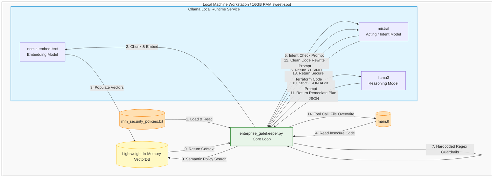

# Autonomous DevSecOps Gatekeeper

This project is an Agentic AI pipeline designed to intercept, audit, and autonomously remediate infrastructure code (Terraform) before deployment. It runs entirely locally using open-source models to ensure strict data privacy.

## Features
* **Zero-Data Leakage:** Uses local Ollama models (`mistral` and `llama3`).
* **Intent Classification:** Blocks malicious prompts or non-infrastructure inputs.
* **Semantic Policy RAG:** Consults a local Vector Database of corporate security policies.
* **Auto-Remediation:** Autonomously rewrites insecure Terraform code to match compliance.

## System Architecture
